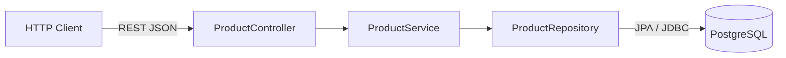
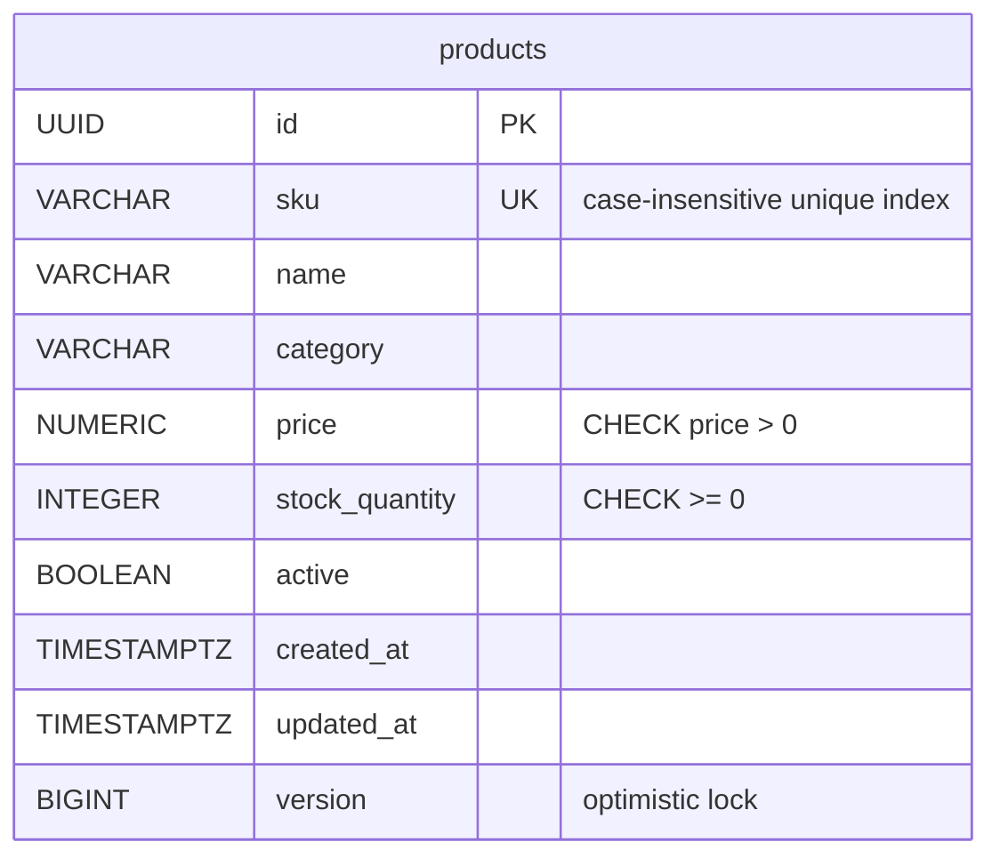
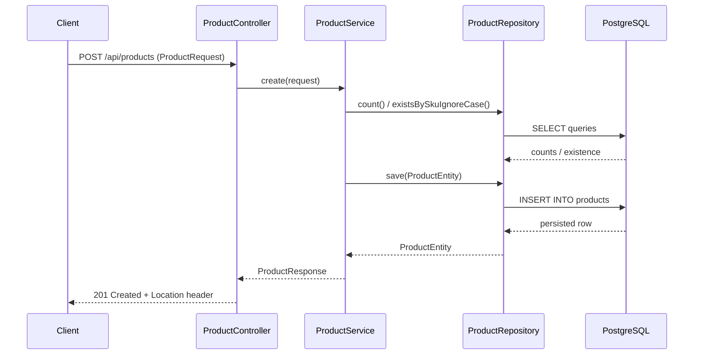

# Week 6 — Architecture Diagrams

## Component diagram

```mermaid
flowchart LR
    Client["HTTP Client"]
    Controller["ProductController"]
    Service["ProductService"]
    Repository["ProductRepository"]
    DB[("PostgreSQL")]

    Client -->|"REST JSON"| Controller
    Controller --> Service
    Service --> Repository
    Repository -->|"JPA / JDBC"| DB
```

## Entity-relationship diagram (products)

```mermaid
erDiagram
    products {
        UUID id PK
        VARCHAR sku UK "case-insensitive unique index"
        VARCHAR name
        VARCHAR category
        NUMERIC price "CHECK price > 0"
        INTEGER stock_quantity "CHECK >= 0"
        BOOLEAN active
        TIMESTAMPTZ created_at
        TIMESTAMPTZ updated_at
        BIGINT version "optimistic lock"
    }
```

## Sequence diagram — create product

```mermaid
sequenceDiagram
    participant C as Client
    participant PC as ProductController
    participant PS as ProductService
    participant PR as ProductRepository
    participant DB as PostgreSQL

    C->>PC: POST /api/products (ProductRequest)
    PC->>PS: create(request)
    PS->>PR: count() / existsBySkuIgnoreCase()
    PR->>DB: SELECT queries
    DB-->>PR: counts / existence
    PS->>PR: save(ProductEntity)
    PR->>DB: INSERT INTO products
    DB-->>PR: persisted row
    PR-->>PS: ProductEntity
    PS-->>PC: ProductResponse
    PC-->>C: 201 Created + Location header
```
