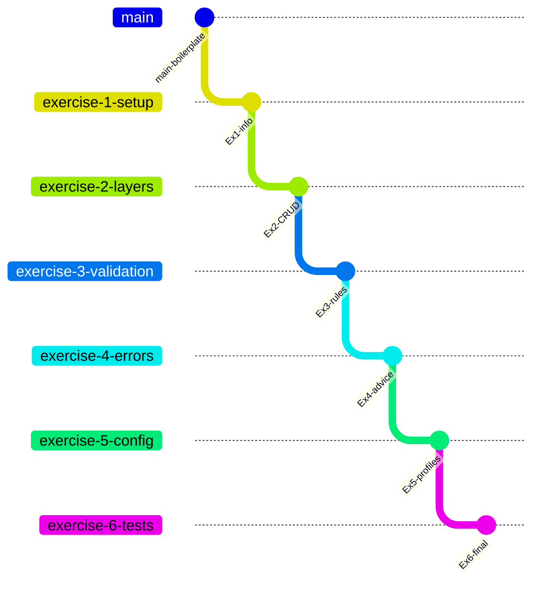

# Product Catalog Implementation Plan

**Status:** Draft — requires spec approval before execution  
**Traces to:** `SPEC.md`, `docs/specs/product-catalog/`  
**Estimated effort:** 7–9 hours (per exercise brief)

## Approach

Implement six incremental exercises in one codebase on branch checkpoints. Each
phase keeps `./mvnw verify` green. Follow TDD: failing test → minimal code →
refactor.



## Dependency order

| Plan ID | Exercise | Depends on | Primary packages |
| --- | --- | --- | --- |
| PLAN-001 | Project setup + `/api/info` | Boilerplate | `controller`, `config` |
| PLAN-002 | Layered CRUD API | PLAN-001 | all layers |
| PLAN-003 | Validation + business rules | PLAN-002 | `dto`, `service`, `exception` |
| PLAN-004 | Global error handling | PLAN-003 | `exception`, `dto` |
| PLAN-005 | Configuration + profiles | PLAN-004 | `config`, `service`, `controller` |
| PLAN-006 | Tests + Actuator + deliverables | PLAN-005 | `src/test`, `README`, `docs/` |

## PLAN-001: Project setup (Exercise 1)

**Requirements:** REQ-001–REQ-005  
**Branch:** `exercise-1-setup`

1. Verify pom dependencies (web, validation, actuator, test).
2. TDD: `@WebMvcTest` for `InfoController` → implement controller reading
   `spring.application.name` and `info.app.version`.
3. Confirm `./mvnw spring-boot:run` and manual curl to `/api/info`.
4. Commit: `feat(setup): add info endpoint and context test`

**Checkpoint:** `./mvnw verify` green; `/api/info` returns configured metadata.

## PLAN-002: Layered design (Exercise 2)

**Requirements:** REQ-010–REQ-020  
**Branch:** `exercise-2-layers`

1. TDD repository: save, find, findAll (defensive copy), existsBySkuIgnoreCase,
   delete, count.
2. TDD service: create (UUID generation), list, get, update, delete.
3. TDD controller: POST 201 + Location, GET list/id, PUT 200, DELETE 204.
4. Add mapper between DTOs and model.

**Checkpoint:** Full CRUD via curl; no validation or global errors yet.

## PLAN-003: Validation and rules (Exercise 3)

**Requirements:** REQ-030–REQ-040  
**Branch:** `exercise-3-validation`

1. Add Bean Validation annotations to `ProductRequest`; `@Valid` on controller.
2. TDD service: duplicate SKU (case-insensitive), not-found exceptions.
3. Define `ProductNotFoundException`, `DuplicateSkuException` — propagate uncaught.

**Checkpoint:** Invalid input fails; duplicate SKU throws; tests document behavior.

## PLAN-004: Error handling (Exercise 4)

**Requirements:** REQ-050–REQ-060  
**Branch:** `exercise-4-errors`

1. TDD `GlobalExceptionHandler` + `ErrorResponse` DTO for each mapped case.
2. Verify consistent JSON for 400/404/405/409/500.
3. `@WebMvcTest` imports handler for controller tests.

**Checkpoint:** All failure paths return uniform error envelope.

## PLAN-005: Configuration (Exercise 5)

**Requirements:** REQ-070–REQ-080  
**Branch:** `exercise-5-config`

1. `CatalogProperties` + yaml + dev/test profiles + env override.
2. TDD `GET /api/products/low-stock` (active only, threshold from config).
3. TDD max-products guard on create (409).

**Checkpoint:** Profile-specific behavior verified with `@ActiveProfiles("test")`.

## PLAN-006: Testing and deliverables (Exercise 6)

**Requirements:** REQ-090–REQ-100  
**Branch:** `exercise-6-tests`

1. Complete service unit test matrix (Mockito).
2. Complete controller MockMvc matrix.
3. Integration tests for create-get-update-delete flows.
4. Actuator: expose health + info only.
5. README, curl collection, test evidence, SELF_REVIEW.md.

**Checkpoint:** `./mvnw verify` green; all deliverables present.

## Risks and mitigations

| Risk | Mitigation |
| --- | --- |
| Route conflict `/api/products/low-stock` vs `{id}` | Register `low-stock` before `{id}` or use distinct path order |
| ConcurrentHashMap visibility | Repository returns copies; no exposed internal map |
| Test pollution between integration tests | `@DirtiesContext` or reset repository bean if needed |
| Over-using `@SpringBootTest` | Prefer Mockito unit tests and `@WebMvcTest` for most cases |

## Verification gates

After each PLAN item:

```bash
./mvnw clean verify
./mvnw spring-boot:run   # smoke test new endpoints
```

Human review before merging each exercise branch forward.
